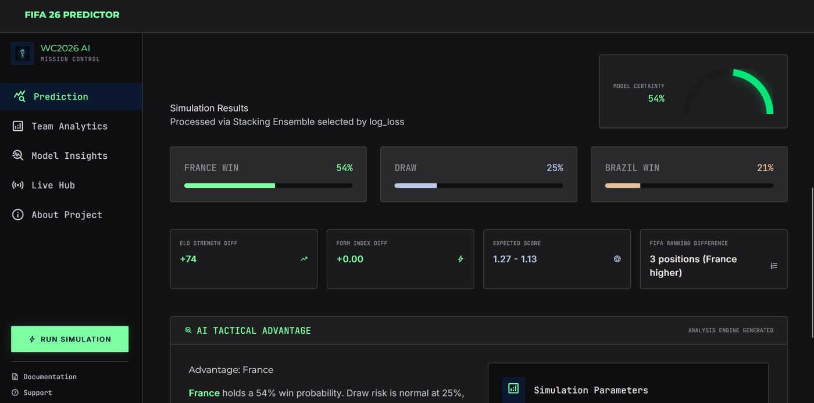
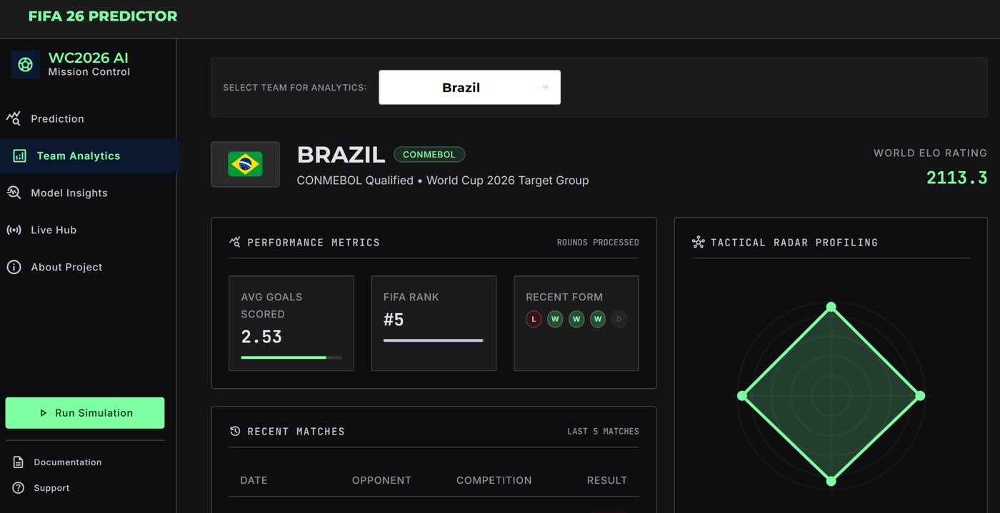
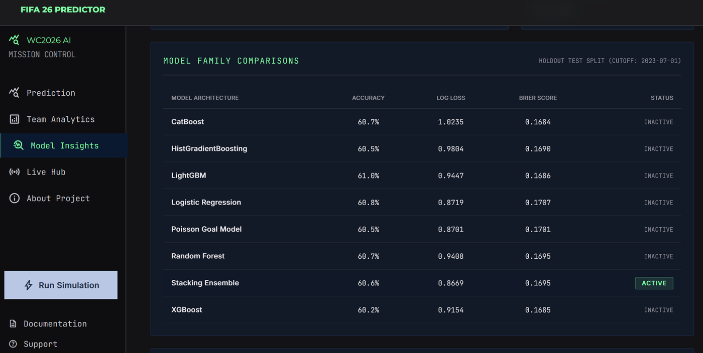
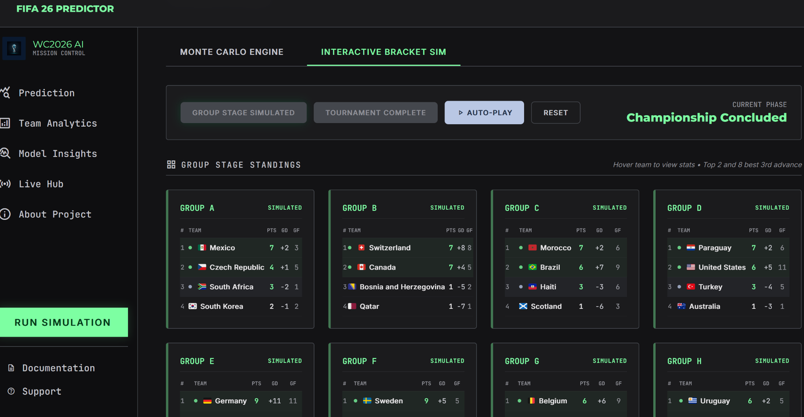

<div align="center">

# WC 2026 Match Outcome Predictor

**An end-to-end machine learning system for calibrated international-football predictions and full World Cup tournament simulation.**

[](https://github.com/veselinkalinov/wc2026-predictor/actions/workflows/ci.yml)
[](https://www.python.org/)
[](https://scikit-learn.org/)
[](https://flask.palletsprojects.com/)
[](https://www.docker.com/)
[](LICENSE)

[Demonstration](docs/DEMO.md) · [Technical documentation](documentation/README.md) · [API overview](#rest-api) · [Run locally](#quick-start)

</div>

---

## Recruiter summary

This project demonstrates the complete lifecycle of a practical machine learning product rather than only a training notebook:

- Built a chronological data and feature pipeline over **40,000+ international matches**.
- Engineered **27 temporal and football-specific features**, including Elo ratings, EWMA form, rolling goal statistics, FIFA-ranking joins, rest days, travel context, neutral venues, and match importance.
- Compared **eight model families** and selected the champion by holdout **log loss**, with calibration and Brier score used to evaluate probability quality.
- Registered a calibrated **Stacking Ensemble** with **60.76% holdout accuracy** and **0.8670 log loss**, compared with **59.22% accuracy** for the Elo heuristic baseline.
- Implemented symmetric neutral-venue inference, expected-goal and scoreline estimation, draw-risk surfacing, and Monte Carlo tournament simulation.
- Exposed predictions through a **Flask REST API with 10 endpoints** and an interactive multi-page dashboard.
- Added Docker Compose, Gunicorn, structured logging, cached live-data integrations, automatic retraining support, pytest coverage, and GitHub Actions CI.

## Product demonstration


The walkthrough covers match configuration, calibrated prediction results, team analytics, model diagnostics, Monte Carlo setup, and the interactive tournament bracket. See [`docs/DEMO.md`](docs/DEMO.md) for a repeatable five-minute demonstration and API example.

## Screenshots

<table>
  <tr>
    <td width="50%"></td>
    <td width="50%"></td>
  </tr>
  <tr>
    <td align="center"><strong>Calibrated match prediction</strong></td>
    <td align="center"><strong>Team analytics and recent form</strong></td>
  </tr>
  <tr>
    <td width="50%"></td>
    <td width="50%"></td>
  </tr>
  <tr>
    <td align="center"><strong>Model comparison and calibration evidence</strong></td>
    <td align="center"><strong>Interactive tournament simulation</strong></td>
  </tr>
</table>

## System overview

```text
Raw match data and rankings
            |
            v
Validation and normalisation
            |
            v
Chronological feature engineering
Elo | form | goals | ranking | rest | travel | match context
            |
            v
Model training, calibration, and probability-first selection
            |
            +--------------------------+
            |                          |
            v                          v
1X2 match prediction          Poisson score model
            |                          |
            +-------------+------------+
                          v
          Flask API, dashboard, and tournament simulator
```

The pipeline deliberately separates historical feature generation, model selection, runtime prediction, and tournament simulation. Neutral-site predictions are evaluated in both team orders and averaged after inversion to remove artificial home/away ordering bias.

## Key capabilities

| Area | Implementation |
| --- | --- |
| Data preparation | Schema validation, canonical team-name mapping, temporal FIFA-ranking joins, filtering, and diagnostics |
| Elo modelling | Chronological ratings with competition-aware importance, home advantage, and goal-margin adjustment |
| Form and goals | Opponent-adjusted EWMA form plus rolling goals scored, conceded, and difference |
| Context features | Rest days, travel/continent mismatch, neutral venue, competitive flag, and match-stake tier |
| Candidate models | Logistic Regression, Random Forest, HistGradientBoosting, LightGBM, CatBoost, XGBoost, Poisson goal model, and Stacking Ensemble |
| Probability quality | Holdout log loss, Brier score, calibration curves, draw-risk output, and calibrated probabilities |
| Prediction runtime | Hot-reloaded model artifacts, symmetric neutral-site averaging, expected goals, and scoreline probabilities |
| Tournament engine | 48-team group and knockout simulation with dynamic state updates and Elo-weighted shootouts |
| Application layer | Flask dashboard, JSON API, live-data cache, scheduler, Gunicorn, Docker, and Docker Compose |
| Quality controls | Pytest suite, generated toy test artifacts, import compilation, and GitHub Actions CI |

## Model performance

The active model is selected by probability quality rather than hard-label accuracy alone. Results below use the chronological holdout split for matches after July 2023.

| Model / baseline | Accuracy | Log loss | Brier score | Status |
| --- | ---: | ---: | ---: | --- |
| **Stacking Ensemble (calibrated)** | **60.76%** | **0.8670** | 0.1695 | **Active** |
| Poisson Goal Model (calibrated) | 60.31% | 0.8719 | 0.1706 | Candidate |
| Logistic Regression (calibrated) | 60.47% | 0.8737 | 0.1712 | Candidate |
| LightGBM (calibrated) | 60.76% | 0.9174 | **0.1686** | Candidate |
| Elo heuristic baseline | 59.22% | 0.9589 | 0.1887 | Baseline |
| Uniform random guessing | 33.33% | 1.0986 | 0.2222 | Reference |

Accuracy remains visible for interpretation, but model registration prioritises log loss because the dashboard and tournament simulator consume full probability distributions.

## Quick start

### Docker

```bash
git clone https://github.com/veselinkalinov/wc2026-predictor.git
cd wc2026-predictor

docker compose up --build
```

Open `http://127.0.0.1:5000/`.

The Compose configuration starts:

- `web`: Flask application served through Gunicorn;
- `scheduler`: periodic live-data fetching and retraining process.

Live-data features use optional environment variables:

```env
RAPIDAPI_KEY=your_rapidapi_key_here
FOOTBALL_DATA_API_KEY=your_footballdata_api_key_here
RETRAINING_INTERVAL_HOURS=24
```

Never commit active API keys. The local application and automated tests use cached or generated fallback data where supported.

### Local Python environment

```bash
python -m venv .venv

# Windows
.venv\Scripts\activate

# macOS or Linux
source .venv/bin/activate

python -m pip install --upgrade pip
python -m pip install -r requirements.txt
python -m src.api.app
```

## Usage

Run the complete training pipeline:

```bash
python -m scripts.run_pipeline
```

Run a shorter retraining sequence:

```bash
python -m scripts.retrain
```

Run data diagnostics:

```bash
python scripts/diagnostics.py
```

Run the test suite:

```bash
python -m pytest tests -q
```

## REST API

All JSON endpoints are prefixed with `/api`.

| Method | Endpoint | Purpose |
| --- | --- | --- |
| `GET` | `/api/health` | Service health check |
| `GET` | `/api/teams` | List supported teams |
| `POST` | `/api/predict` | Calibrated 1X2 prediction, expected goals, and scorelines |
| `POST` | `/api/simulate` | Monte Carlo tournament simulation |
| `GET` | `/api/team-details/<team_name>` | Current team metrics and radar values |
| `GET` | `/api/team-matches/<team_name>` | Recent match history |
| `GET` | `/api/visualisations/<filename>` | Generated model visualisations |
| `GET` | `/api/model-meta` | Active model and evaluation metadata |
| `GET` | `/api/live/standings` | Cached or live tournament standings |
| `GET` | `/api/live/fixtures` | Cached or live fixtures |

Example prediction request:

```bash
curl -X POST http://127.0.0.1:5000/api/predict \
  -H "Content-Type: application/json" \
  -d '{
    "home_team": "France",
    "away_team": "Brazil",
    "is_neutral": 1,
    "is_competitive": 1,
    "match_stake": 4,
    "match_date": "2026-07-10"
  }'
```

## Repository structure

```text
wc2026-predictor/
├── .github/workflows/       # GitHub Actions CI
├── config.yaml              # Central project configuration
├── data/                    # Raw, cleaned, engineered, and cached data
├── documentation/           # Detailed learning and technical documentation
├── docs/                    # Recruiter-facing demonstration assets
├── notebooks/               # Exploratory notebooks
├── scripts/                 # Pipeline, retraining, diagnostics, and scheduler entry points
├── src/
│   ├── api/                 # Flask app, routes, and templates
│   ├── data/                # Fetching, validation, and cleaning
│   ├── features/            # Elo, form, goals, and feature assembly
│   ├── models/              # Training, evaluation, prediction, and simulation
│   └── utils/               # Configuration, logging, and API clients
├── tests/                   # Pytest suite and generated test fixtures
├── visualisations/          # Confusion matrix, feature importance, and calibration plots
├── Dockerfile
├── docker-compose.yaml
├── requirements.txt
└── wsgi.py
```

## Continuous integration

The GitHub Actions workflow runs on pull requests and pushes to `master` using Python 3.12. It:

1. installs the pinned dependencies;
2. compiles source, script, and test modules to detect import or syntax failures;
3. runs the complete pytest suite.

Tests generate isolated toy model artifacts when trained models are absent, allowing CI to validate a clean checkout without committing production model binaries.

## Design decisions and limitations

- Predictions are probabilistic estimates, not guarantees.
- Friendlies increase data volume but introduce squad-rotation and intensity noise.
- Rolling features require cold-start defaults for teams with limited history.
- Initial Elo values are static before enough chronological evidence accumulates.
- Live-data endpoints depend on third-party API availability and credentials, with cached or mock fallbacks where implemented.
- Tournament outcomes compound uncertainty across many simulated matches.

The full methodology, file map, implementation notes, known risks, and interview-oriented rebuild guide are available in [`documentation/`](documentation/README.md).

## Technology stack

**Python, pandas, NumPy, SciPy, scikit-learn, LightGBM, CatBoost, XGBoost, Flask, Gunicorn, pytest, Matplotlib, Seaborn, Docker, Docker Compose, GitHub Actions**

## License

This project is released under the [MIT License](LICENSE).

## Author

**Veselin Kalinov**  
Computer and Software Engineering student at the Technical University of Sofia

- [GitHub](https://github.com/veselinkalinov)
- [LinkedIn](https://www.linkedin.com/in/veselinkalinov/)
