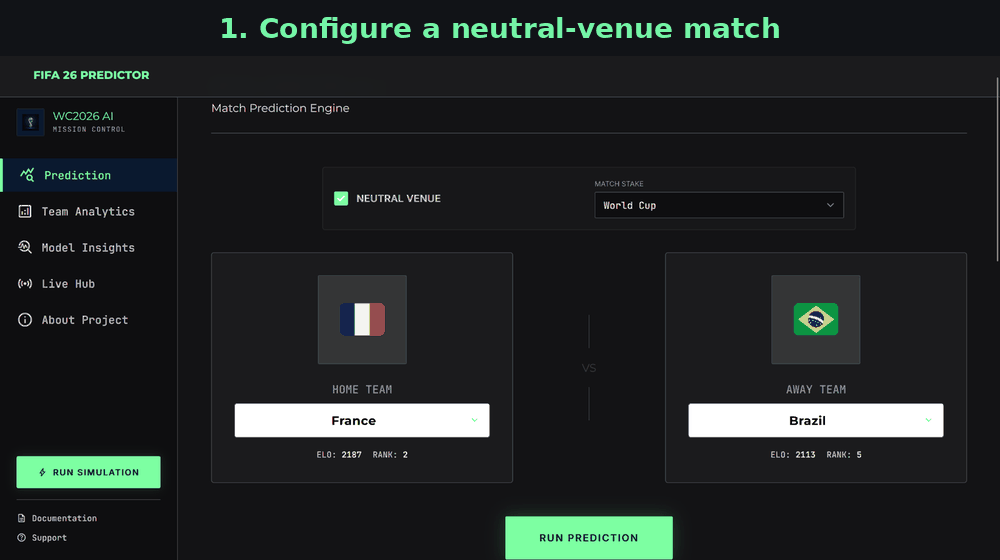

# WC 2026 Predictor Demonstration

This guide provides a short, repeatable walkthrough of the project for recruiters, reviewers, and technical interviewers.

## Recorded walkthrough



## Suggested five-minute demo

### 1. Start the application

```bash
docker compose up --build
```

Open `http://127.0.0.1:5000/`.

### 2. Generate a match prediction

1. Open **Prediction**.
2. Select two national teams.
3. Enable **Neutral Venue** for a tournament-style comparison.
4. Set the match stake to **World Cup**.
5. Run the prediction.

The result view presents calibrated home-win, draw, and away-win probabilities together with expected goals, Elo difference, ranking difference, model certainty, and the inference parameters used for the calculation.

### 3. Inspect team analytics

Open **Team Analytics** and select a team. Review:

- current World Elo rating;
- FIFA ranking;
- rolling goal average;
- recent results;
- attack, defence, tactical, and fitness indicators.

### 4. Review model evidence

Open **Model Insights** to inspect:

- the active model and its holdout metrics;
- model-family comparisons;
- feature-importance output;
- confusion matrix;
- probability-calibration curve;
- documented limitations and symmetric neutral-venue evaluation.

### 5. Run a tournament simulation

Open **Run Simulation** and choose either:

- **Monte Carlo Engine** for repeated end-to-end tournament simulations; or
- **Interactive Bracket Sim** for a visible group-stage and knockout walkthrough.

The simulator samples scorelines from the goal model and updates tournament state as matches progress.

## REST API example

With the server running, submit a neutral-venue prediction:

```bash
curl -X POST http://127.0.0.1:5000/api/predict \
  -H "Content-Type: application/json" \
  -d '{
    "home_team": "France",
    "away_team": "Brazil",
    "is_neutral": 1,
    "is_competitive": 1,
    "match_stake": 4,
    "match_date": "2026-07-10"
  }'
```

The endpoint returns three-way probabilities, the selected outcome, expected goals, scoreline probabilities, model metadata, and match context.

## Screens included in the repository

| View | File |
| --- | --- |
| Prediction configuration | `docs/assets/prediction-input.png` |
| Prediction results | `docs/assets/prediction-results.png` |
| Team analytics | `docs/assets/team-analytics.png` |
| Model insights | `docs/assets/model-insights.png` |
| Monte Carlo simulator | `docs/assets/tournament-simulator.png` |
| Interactive bracket | `docs/assets/interactive-bracket.png` |
